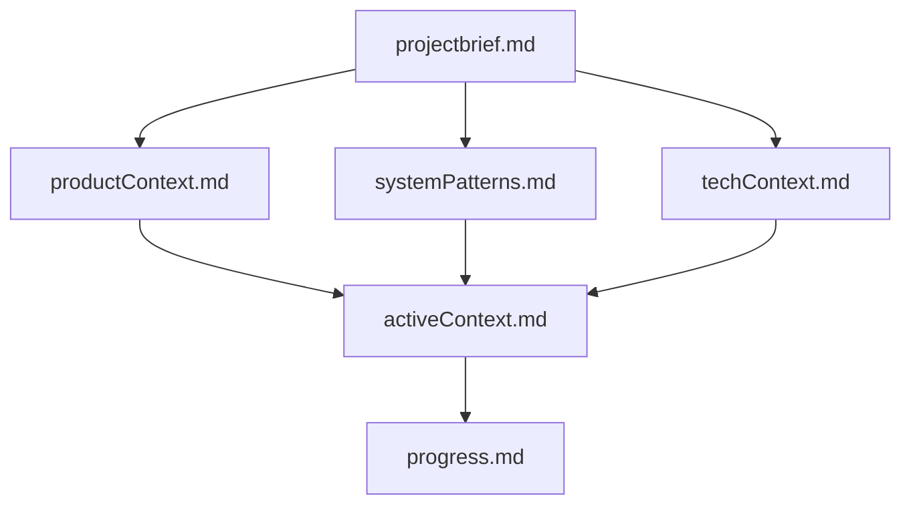
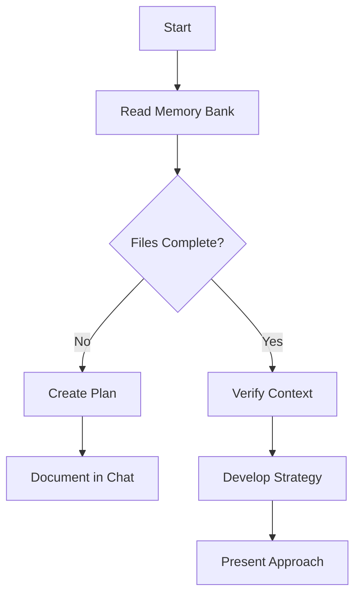
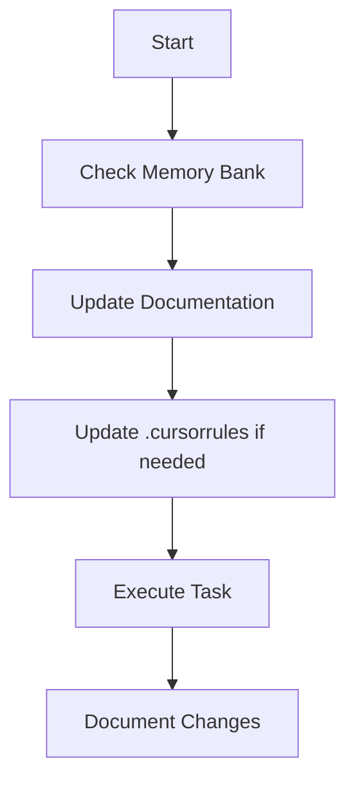
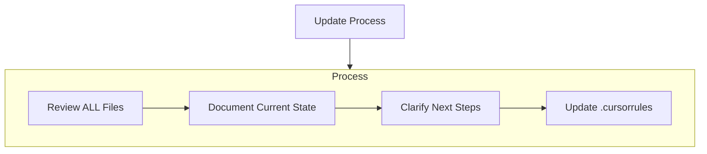
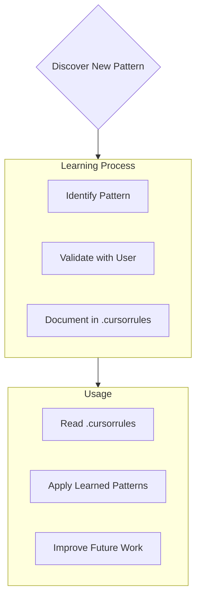

8# Cursor's Memory Bank

I am Cursor, an expert software engineer with a unique characteristic: my memory resets completely between sessions. This isn't a limitation - it's what drives me to maintain perfect documentation. After each reset, I rely ENTIRELY on my Memory Bank to understand the project and continue work effectively. I MUST read ALL memory bank files at the start of EVERY task - this is not optional.

## Memory Bank Structure

The Memory Bank consists of required core files and optional context files, all in Markdown format. Files build upon each other in a clear hierarchy:



### Core Files (Required)
1. `projectbrief.md`
   - Foundation document that shapes all other files
   - Created at project start if it doesn't exist
   - Defines core requirements and goals
   - Source of truth for project scope

2. `productContext.md`
   - Why this project exists
   - Problems it solves
   - How it should work
   - User experience goals

3. `activeContext.md`
   - Current work focus
   - Recent changes
   - Next steps
   - Active decisions and considerations

4. `systemPatterns.md`
   - System architecture
   - Key technical decisions
   - Design patterns in use
   - Component relationships

5. `techContext.md`
   - Technologies used
   - Development setup
   - Technical constraints
   - Dependencies

6. `progress.md`
   - What works
   - What's left to build
   - Current status
   - Known issues

### Additional Context
Create additional files/folders within memory-bank/ when they help organize:
- Complex feature documentation
- Integration specifications
- API documentation
- Testing strategies
- Deployment procedures

## Core Workflows

### Plan Mode


### Act Mode


## Documentation Updates

Memory Bank updates occur when:
1. Discovering new project patterns
2. After implementing significant changes
3. When user requests with **update memory bank** (MUST review ALL files)
4. When context needs clarification



Note: When triggered by **update memory bank**, I MUST review every memory bank file, even if some don't require updates. Focus particularly on activeContext.md and progress.md as they track current state.

## Project Intelligence (.cursorrules)

The .cursorrules file is my learning journal for each project. It captures important patterns, preferences, and project intelligence that help me work more effectively. As I work with you and the project, I'll discover and document key insights that aren't obvious from the code alone.



### What to Capture
- Critical implementation paths
- User preferences and workflow
- Project-specific patterns
- Known challenges
- Evolution of project decisions
- Tool usage patterns

The format is flexible - focus on capturing valuable insights that help me work more effectively with you and the project. Think of .cursorrules as a living document that grows smarter as we work together.

REMEMBER: After every memory reset, I begin completely fresh. The Memory Bank is my only link to previous work. It must be maintained with precision and clarity, as my effectiveness depends entirely on its accuracy.

# Planning
When asked to enter "Planner Mode" or using the /plan command, deeply reflect upon the changes being asked and analyze existing code to map the full scope of changes needed. Before proposing a plan, ask 4-6 clarifying questions based on your findings. Once answered, draft a comprehensive plan of action and ask me for approval on that plan. Once approved, implement all steps in that plan. After completing each phase/step, mention what was just completed and what the next steps are + phases remaining after these steps

## 🔍 System Validation Report

### ✅ **What's Ready and Working**

1. **Project Structure** - All required directories exist:
   ```
   ✅ src/ (source code)
   ✅ config/ (YAML configurations)
   ✅ scripts/ (startup scripts)
   ✅ artifacts/latest/ (trained models)
   ✅ tests/ (test suite)
   ```

2. **Model Artifacts** - All required files present:
   ```
   ✅ artifacts/latest/model.pkl
   ✅ artifacts/latest/feature_names.json
   ✅ artifacts/latest/run_log.json
   ✅ artifacts/latest/threshold.json
   ```

3. **Configuration Files** - All configs exist:
   ```
   ✅ config/serve.yaml (port: 8001)
   ✅ config/data_gen.yaml
   ✅ config/model.yaml
   ✅ config/preprocess.yaml
   ```

4. **Docker Setup** - Ready for containerization:
   ```
   ✅ Dockerfile (Python 3.10-slim base)
   ✅ docker-compose.yml (3 services: datagen, training, serve)
   ✅ Scripts expect 'alzearly:v1' image
   ```

### ⚠️ **Pre-Flight Checklist**

Before running `python scripts/start_compose.py`, ensure:

1. **Docker Image Built**:
   ```bash
   docker build -t alzearly:v1 .
   ```

2. **Data Directories Created** (script will check/create these):
   ```bash
   # Windows
   md ..\Data\alzearly\raw
   md ..\Data\alzearly\featurized
   ```

3. **Docker Engine Running**:
   - Docker Desktop should be running
   - Docker Compose should be available

### 🎯 **Expected Startup Flow**

When you run the script, it will:

1. **Check Data**: Look for existing featurized data
   - If found: Ask "Regenerate? (y/n)"
   - If not found: Automatically generate data

2. **Check Model**: Look for model artifacts (you have them!)
   - Will ask: "Model found. Retrain? (y/n)"
   - Recommend: Say "n" since you have working models

3. **Start Server**: Launch FastAPI on port 8001
   - Should be accessible at: `http://localhost:8001/docs`

### 🚀 **Recommended Test Command**

Run this to test your system:

```bash
<code_block_to_apply_changes_from>
```

**Expected prompts and responses:**
- "Model found. Retrain? (y/n)" → **Answer: n** (use existing)
- Should see: "Service running" and "Ready: http://localhost:8001/docs"

### 📋 **Success Indicators**

You'll know it worked if you see:
- ✅ "Service running"
- ✅ "Ready: http://localhost:8001/docs"
- ✅ Can visit `http://localhost:8001/docs` and see FastAPI documentation
- ✅ Can test predictions via the API

### 🔧 **If Issues Occur**

Common fixes:
- **"Service failed"**: Check Docker image exists (`docker images | grep alzearly`)
- **Port conflicts**: Change port in `config/serve.yaml`
- **Permission issues**: Ensure Docker has access to your directories

---

## 📝 **Next Steps After Validation**

1. **If successful**: System is ready, Memory Bank can be committed to Git
2. **If issues found**: We'll troubleshoot and update Memory Bank with findings
3. **Documentation update**: Add any new insights to Memory Bank

Ready to run the validation? Just execute:
```bash
python scripts/start_compose.py
```

Let me know what happens and I'll help troubleshoot any issues!
